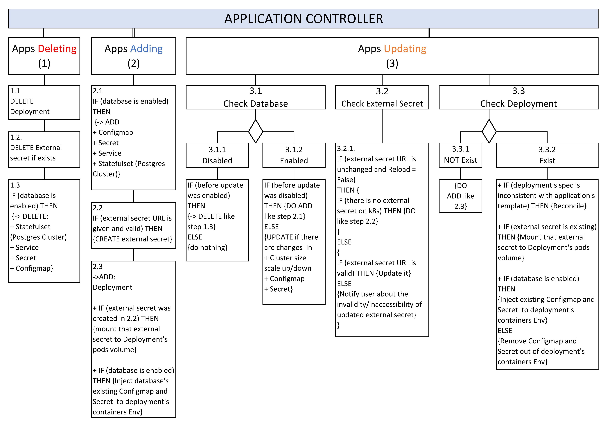

# Kubernetes "Application" Custom Resource Controller
## 1. Introduction
This project was proposed as an assignment to Thai Hoang (HoangBamberg@Gmail.Com) during his 6-week internship at Delivion GmbH (www.delivion.de). Delivion plans, develops and operates multi-cloud platforms for customers in Digital Entertainment, Financial companies and Insurance providers. 

## 2. Acknowledgement
The project was developed after studying the post from Martin Helmich (https://www.martin-helmich.de/en/blog/kubernetes-crd-client.html). The project skeleton was originally adapted from his code templates.

## 3. Task description
### Overall goal

The overall goal is to create an additional abstraction layer on top of native Kubernetes resources to describe an "Application".

As a user, I want to be able to create a resource looking more or less like follows:

    apiVersion: delivion.io/alpha1
    kind: Application
    metadata:
        name: nginx-whatever
    spec:
        database: true
        externalsecret: http://XXXX/xxx.json
        replicas: 3
        template:
            spec:
                containers:
                    -
                    name: nginx
                    image: nginx:1.14.2
                    ports:
                    - containerPort: 80

If I create such a resource and submit it to Kubernetes, the controller should ensure that the appropriate Kubernetes resources get created.

1. It should create a **deployment** based on the template spec and number of replicas (details in Step 1 below).
2. In case **database** is set to true, create resources for a PostgreSQL database and inject the secrets as environment variables in the application (details  in Step 2 below).
3. In case the **externalsecret** is specified, read it and convert it to a normal k8s secret, and inject it into the application (details in Step 3 below).

Now that we have the overall goal, let's go through in more details:

### Task 3.1. Get to know Kubernetes Go API

### Task 3.2. Create basic (proxy like) Application Controller

At this step, just consider the Application definition above, but without the `database` and `externalsecret`.
You will create a controller that adds the additional `Application` layer, but doesn't add any additional functionality. What it will do, however, is:

* When users submit an `Application` to kubernetes, the corresponding `Deployment` gets created automatically
* When users delete an `Application`, the corresponding `Deployment` gets deleted
* When users modify the `Application`, the corresponding changes are made to the `Deployment`
* When users delete the `Deployment` (but not the `Application`), it gets recreated
* When users modify the `Deployment` (but not the `Application`), the changes are rolled back (i.e, it is kept in sync with the `Application`)
* When users `kubectl describe` the Application, it shows the status of the Deployment

### Task 3.3. Add support for Database

* Deploy a Postgres cluster on Kubernetes when users enable and disable by setting database = True/False correspondingly
  * Disk size
  * Database name (please note that for the moment, one `Application` use one Postgres cluster, so database name is equal to the Postgres cluster name)
* Define what logics with Posgres clusters does your Controller supports (same as the `When I ...` in the Step 1, but this time you should define it yourself)
* Implement the defined logics above
* Setup the application pod (managed by the `Application` CR) to connect to the Postgres cluster

### Task 3.4. Add support for external Secrets

* Deploy a (web) application to Kubernetes. It should:
  * Expose content like JSON/YAML via a port (Recommendation 8080)
  * Be reachable from outside of the cluster & secured via TLS (VPN is enough)

* Add external Secret/Value support in the `Application` CRD:
  * Type (E.g. JSON/YAML) - Please focus on the type that you exposed via step 3.1
  * URL - URL to the secret (e.g. <https://delivion-secrets/test.json>)

* Again, define the logic(s) for these requirements
* Adapt your Controller to be able to read the data and convert it either as Secret or as a Configmap to the actual application pod

## 4. Implementation
* Re-design CRD yaml  
 https://github.com/hoangphanthai/Kubernetes_Custom_Resource_Controller/blob/main/crd/app1.yaml
 * Implement Controller logics

  

## 5. Setup and Start the Controller
#### Step 5.1: Clone the project

`$ git clone https://github.com/hoangphanthai/Kubernetes_Custom_Resource_Controller.git`

#### Step 5.2: Submit the "Application" CRD to Kubernetes  
`$ kubectl apply  -f  https://raw.githubusercontent.com/hoangphanthai/Kubernetes_Custom_Resource_Controller/main/crd/crd.yaml`

#### Step 5.3: Start the Controller
`$ cd Kubernetes_Custom_Resource_Controller`  
`$ go run .`

#### Step 5.4: Apply "Application" custom resources and Play around

*  Apply an "application" - **app1** without database cluster to Kubernetes  
`$ kubectl apply -f https://raw.githubusercontent.com/hoangphanthai/Kubernetes_Custom_Resource_Controller/main/crd/app1.yaml`  
*  Enable database cluster in **app1**  
`$ kubectl apply  -f  https://raw.githubusercontent.com/hoangphanthai/Kubernetes_Custom_Resource_Controller/main/crd/app1DbEnabled.yaml`  
*  Play around with "Applications"              
   *   **Update** the app1 specs (changing replicas, application specs, database cluster size...) and re-apply  
   *   **Add** another "application" - **app2**:  
	      `$ kubectl apply  -f  https://raw.githubusercontent.com/hoangphanthai/Kubernetes_Custom_Resource_Controller/main/crd/app2.yaml`  
   *   **List** the applications  
          `$ kubectl get application`  
   *   **Delete** application **app1**  
          `$ kubectl delete application app1`
   
   ..... more logics defined in the above step **4. Implementation**        
